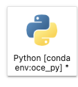

# python-starter

quick start to setup a python environment for oceanographic data analysis

### Setup Instructions
0. Have git and github account setup either from command line or [GitHub Desktop](https://desktop.github.com/)
1. Install [Anaconda](https://www.anaconda.com/products/distribution) or [Miniconda](https://docs.conda.io/en/latest/miniconda.html)
2. This repository is a [template repository](https://docs.github.com/en/repositories/creating-and-managing-repositories/creating-a-repository-from-a-template) and can be used as a starting point for your own repositories. Create your new repository using the ***Use this template*** button on [GitHub](https://github.com/boom-lab/python-starter)
3. Clone your new repository to your local machine:
   ```git clone https://github.com/myusername/my-new-repo-name.git```
4. Using Terminal, navigate to the folder where you have cloned the repository (e.g., ```cd ~/Documents/GitHub/my-new-repo-name```)
5. create a new environment using the Conda package manager:
  ```conda env create -f environment.yml```
  This command creates a new python environment called **oce_py** and installs the packages listed in the environment.yml file
6. You can then activate the new environment using:
  ```conda activate oce_py```

### Starting a new notebook ###

1. Activate your environment if you have not already
  ```conda activate oce_py```
  2. launch jupyter lab:
  ```jupyter lab```

  3. This will open a browser window. Select the Notebook option with the "oce_py" environment to create a new notebook:

  
